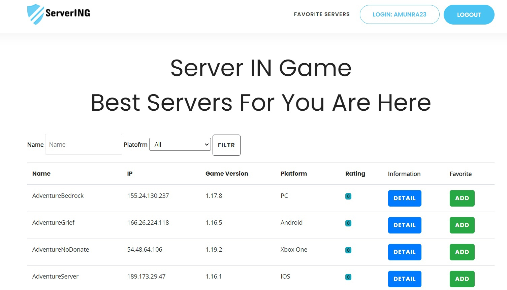

# Курсовая работа по Базам данных (семестр 6)

[Я в Телеграм](https://t.me/amunra2) 

## Общая информация

* **Тема**: Создание информационной системы серверов для видеоигры
* **Семестр**: 6
* **Язык**: C#
* **РПЗ**: [ссылка](./docs/pdf/rpz_cvetkov.pdf)
* **Презентация**: [ссылка](./docs/pdf/all/Презентация%20БД%20Курсовой%20проект%20(Цветков%20И.%20А.%20ИУ7-63Б)%20(1).pdf)
* **Код**: [ссылка](./src/)

## Пример UI

## Примечание

Для сборки LaTex требуется дополнительный файл настроек и лого, которые можно найти по [ссылке](https://github.com/amunra2/bmstu-iu7)

_@amunra2 (2022г.)_
